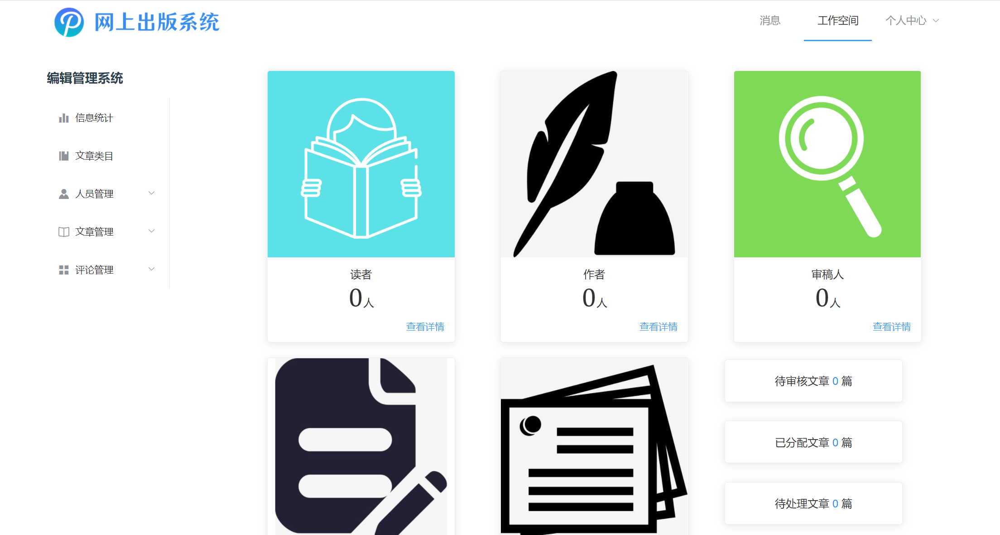

## 网上出版系统后端

  

> 北航 1921 软件工程大作业

前端：[https://github.com/ZewanHuang/Online-Publish-Vue](https://github.com/ZewanHuang/Online-Publish-Vue)

### 项目介绍

网上出版系统，为读者、作者、审稿人、编辑提供一站式服务。在本站，读者可以查阅已发布文章、申请成为作者，作者可以上传发布文章，审稿人审阅文章并给出评论，编辑统一分配管理。

本项目帮助作者更方便地投稿，促进作者与审稿人的交流，提供编辑统一管理的一体化平台。

### 如何使用

运行本项目前，请先根据自身情况修改 utils/Global.py 内的数据库、邮箱信息。此处仅给出 MySQL 连接模板，若需连接其它类型数据库，需对应修改 django3/settings.py 的内容。

修改信息后，只需在终端输入下列命令，运行 init.py 文件，即可完成数据库初始化，并自动为您运行项目。

```python
python init.py
```

### 页面展示

> 此仓库仅后端，如想完整运行网站，需到 [前端仓库](https://github.com/ZewanHuang/Online-Publish-Vue) 配置并运行。

欢迎页面


编辑管理页面



搜索主页


